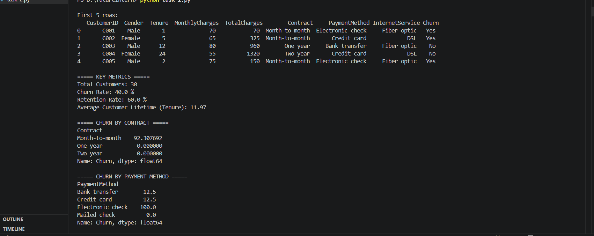
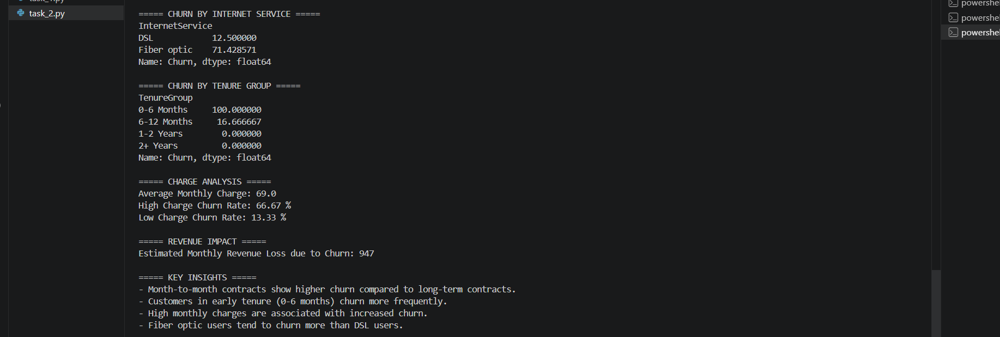
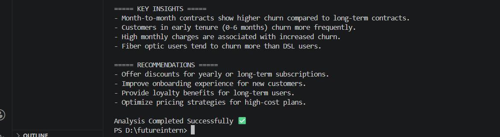
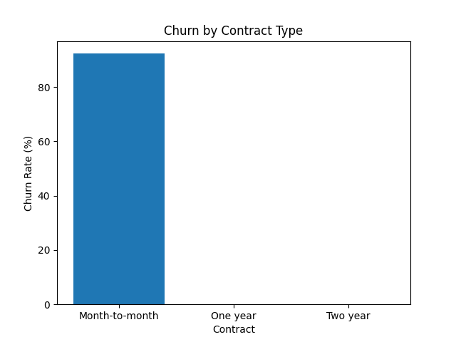
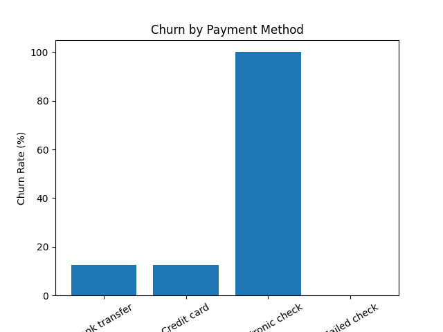
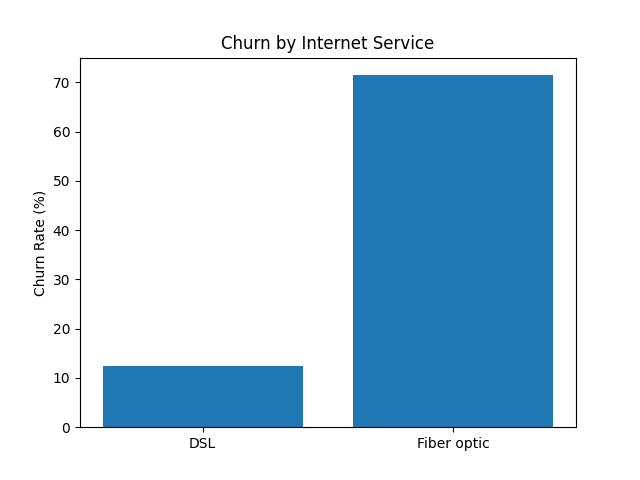
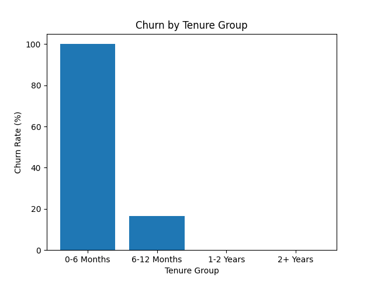

# 📊 Customer Churn Analysis (Task 2)

## 🔍 Project Overview
This project analyzes customer churn patterns in a subscription-based business.  
The goal is to identify why customers leave and suggest strategies to improve retention.

---

## 📁 Dataset
- 30 customer records (simulated dataset)
- Features include:
  - Gender
  - Tenure
  - Monthly Charges
  - Contract Type
  - Payment Method
  - Internet Service
  - Churn Status

---

## 🛠️ Tools Used
- Python
- Pandas
- Matplotlib

---

## 📊 Key Metrics
- Total Customers: 30  
- Churn Rate: 40%  
- Retention Rate: 60%  
- Average Customer Lifetime: ~12 months  

---

## 🖥️ Output
  
  

---

## 📈 Analysis Performed
- Churn by Contract Type  
- Churn by Payment Method  
- Churn by Internet Service  
- Churn by Tenure Group  
- Revenue Impact Analysis  

---

## 📊 Visualizations

  
  
  
  

---

## 🔍 Key Insights
- Month-to-month contracts have the highest churn  
- Customers in first 6 months are most likely to churn  
- High monthly charges increase churn risk  
- Fiber optic users show higher churn  

---

## ✅ Recommendations
1. Improve early customer onboarding experience  
2. Promote long-term subscription plans  
3. Encourage auto-pay instead of electronic check  
4. Optimize pricing for high-cost plans  
5. Improve fiber service quality  

---

## 📉 Business Impact
Estimated monthly revenue loss due to churn: ₹947  

---

## 📌 Conclusion
Customer retention can be improved by focusing on early engagement, pricing strategy, and service quality.

---

## 👨‍💻 Author
**Teja Aswani**
